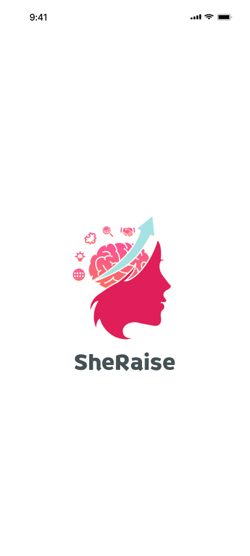
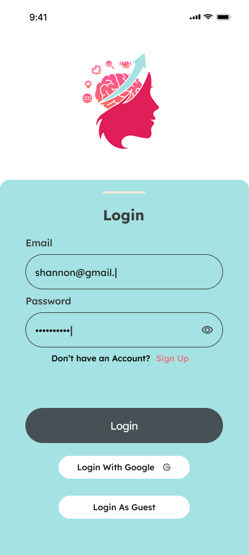

<h1 align="center">
  SheRaise
</h1>

  <em>Empowering Women Through Learning, Mentorship, and Career Growth</em>

  

## 🌟 About SheRaise
SheRaise is a mobile application designed to empower women through education, skill development, career support, and mentorship. Built using Kotlin and Android Studio, the app provides a space for women to grow professionally through courses, job-seeking features, and mentoring connections.

## 🎨 Logo Meaning

The name **SheRaise** comes from _She_ (representing women) and _Raise_ (to uplift or elevate).  
The logo is designed to reflect:
- **A growing mind**: symbolizing the continuous development of women's skills and knowledge.
- **Radiating petals or rays**: representing disciplines from various professional fields.
- **Empowerment & Unity**: a modern, clean design to show strength, femininity, and connectedness.

The logo communicates the core mission of SheRaise: _to help women rise, grow, and thrive._

## 🚀 Features

- **🧠 Courses**
Learn new skills through:
  - 📖 Articles
  - 📚 E-Books
  - 🎥 Interactive Video Learning
  - 📝 Skill Assessments

Categories include:
> Coding · Digital Marketing · Public Speaking · Design · Editing · and more

- **👩‍🏫 Mentor**
  - Browse mentor profiles with certifications and expertise
  - Access contact details and LinkedIn
  - Request guidance and build professional relationships

- **💬 Friends**
  - Build a community of supportive women.
  - Use chat features to share and grow together.

- **📌 JobSeeker**
  - Discover curated job listings
  - Read full descriptions and requirements
  - Apply in-app with one click
  - Managed and verified by admin team

- **👥 Role Selection**
  - 👩 Student: Takes entrance test, accesses learning materials
  - 🎓 Mentor: Registers, waits for approval, guides students
  - 🧑‍💼 Admin: Manages users, courses, and job listings
  - 🕶 Guest: Can view courses but with limited access

## 🚧 How It Works

> Get started in a few simple steps:
1. Sign up (as Guest, Student, or Mentor)
2. Take the Entry Test (optional)
3. Explore personalized course recommendations
4. Learn, connect, and grow 🌱

## 🔄 User Flow – SheRaise App

SheRaise is designed with three user types: **Student**, **Mentor**, and **Guest**. Each user has a tailored journey for an optimal learning and mentoring experience.

### 👩‍🎓 Student Flow

1. **SplashScreen**  
   → Displays SheRaise logo and animation on app launch.

2. **Select Role**  
   → User chooses **Student**.

3. **Entrance Test**  
   → New users must take an entrance test. The Entrance Test assesses the user's knowledge to categorize them into Beginner, Intermediate, or Advanced level courses. The test includes 10 multiple-choice questions from basic Computer Science.
   → Existing users can choose to **Log In**.

5. **Take Test**  
   → 10-question multiple choice test.  
   → Determines user's skill level (Beginner, Intermediate, Advanced).

6. **Sign Up**  
   → User creates an account to view test results and unlock full features.

7. **Homepage**  
   → Full access to:
   - 🎓 Courses
   - 👩‍🏫 Mentor
   - 💼 JobSeeker
   - 🤝 Friends
   - 💬 Forum

### 🧑‍🏫 Mentor Flow

1. **SplashScreen**  
   → App opens with animated logo.

2. **Select Role**  
   → User chooses **Mentor**.

3. **Register as Mentor**  
   → Mentor fills out registration form:
   - Name
   - Area of expertise
   - Certifications
   - Contact info / LinkedIn

4. **Pending Approval**  
   → Account status is set to **Pending**.  
   → Admin reviews and approves mentor application.

5. **Mentor Homepage**  
   → Once approved, mentor can:
   - Manage their profile
   - View mentee requests
   - Respond via chat

### 🕊️ Guest Flow

1. **SplashScreen**  
   → Initial logo display on app launch.

2. **Select Role**  
   → User selects **Continue as Guest**.

3. **Guest Homepage**  
   → Limited access to:
   - View available courses (no enrollment)
   - View mentor profiles (no direct contact)
   - Read educational articles  
   → Prompted to sign up for full access.
 
## 🛠️ Tech Stack

- **Language**: Kotlin
- **IDE**: Android Studio Meerkat | 2024.3.1
- **Database**: MySQL (optional, if backend integrated)
- **Version Control**: GitHub

## 💻 Hardware Specs

| Component  | Specification              |
|------------|----------------------------|
| Platform   | Windows 11                 |
| Processor  | Intel Core i5-10210U 1.6GHz|
| RAM        | 8 GB                       |
| GPU        | NVIDIA MX350               |
| Display    | 15.6" LED Screen           |

## 📷 Assets

### 🔗 Logo

  

### 🔗 Wireframe

  
  
  
  
  
  
  
  
  

## 👩‍💻 Developers

- **Josiah Owen Yoswandi**
- **Orville Dwayne Taylor**
- **Sean Kenneth Tommy Keleyan**

